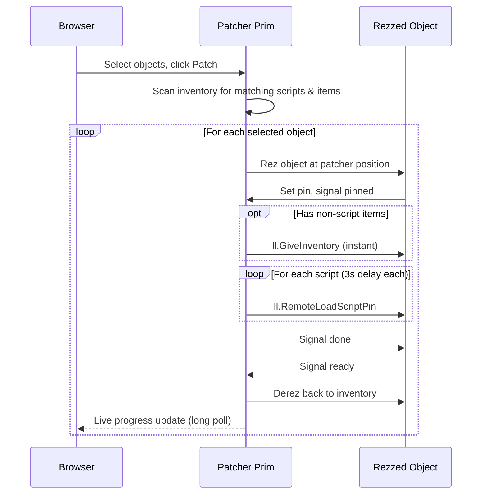
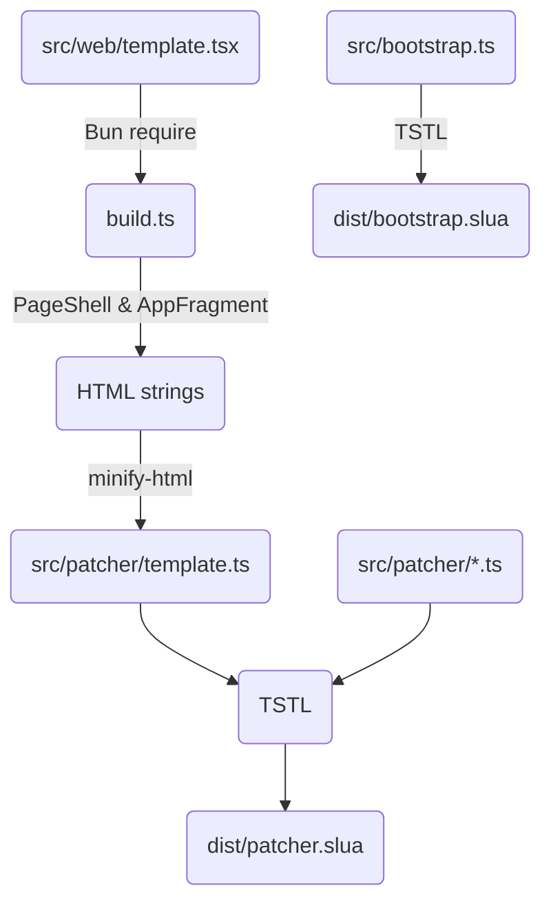
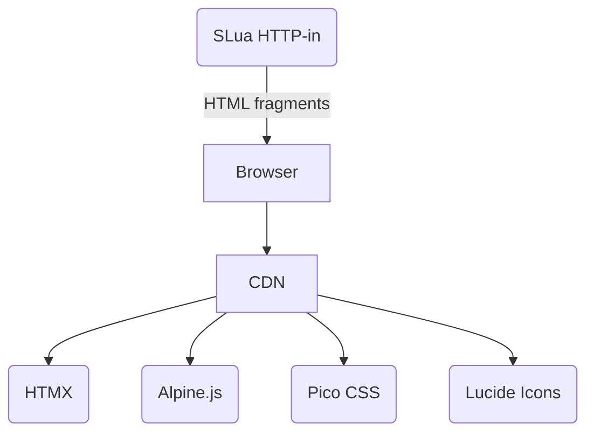

# SLua Derez Patcher

Speed up development with bulk script and inventory updates across objects, controlled from a web UI. A single patcher prim holds everything and pushes changes on command.

It rezzes objects, transfers scripts via `ll.RemoteLoadScriptPin` and other inventory (notecards, textures, sounds, etc.) via `ll.GiveInventory`, then derezes it back -- updating the object in-place.

Built with [TypeScriptToLua](https://typescripttolua.github.io/) and [`@gwigz/slua-tstl-plugin`](https://github.com/gwigz/slua).

## Scripts

### `dist/patcher.slua` - goes in the patcher prim

On script start, requests an HTTP-in URL and prints it to owner chat. Open the URL in a browser to access the web UI dashboard where you can:

- Browse patchable objects with their scripts and items
- Select individual objects or use "Select All"
- Patch selected objects or all at once
- Watch live progress via long polling

Chat command `/7 url` prints the HTTP-in URL again if needed.

### `dist/bootstrap.slua` - add to each patchable object

Enables remote script loading. On rez by the patcher, sets the access pin and signals readiness back when done. Tweak to suit your workflow, i.e. if there's data you need to load from notecards: only state ready once you're actually ready.

## Inventory Layout

Items named `ObjectName/item-name` target that specific object. This works for scripts, notecards, textures, sounds, animations, and any other inventory type. Wrap the prefix in `{...}` for pattern matching.

| Item Name                             | Matches                                  |
| ------------------------------------- | ---------------------------------------- |
| `lantern.obj/vfx.slua`                | `lantern.obj` only (script)              |
| `lantern.obj/config`                  | `lantern.obj` only (notecard)            |
| `{*}/utilities.slua`                  | every object                             |
| `{fire-*.obj}/embers.slua`            | `fire-pit.obj`, `fire-torch.obj`, etc.   |
| `{*-light.obj}/dim.slua`              | `desk-light.obj`, `wall-light.obj`, etc. |
| `{lantern.obj,campfire.obj}/vfx.slua` | `lantern.obj` and `campfire.obj`         |

Extensions and casing are purely convention -- the matching is on the full inventory name before the `/`. Objects and the patcher script itself are always excluded from matching.

## How It Works



## Project Structure

```
├── build.ts                  Build script (template compilation + TSTL)
├── src/
│   ├── bootstrap.ts          Standalone bootstrap script
│   ├── web/                  Build-time only (JSX → HTML strings)
│   │   ├── jsx.ts            Custom JSX factory: h() → string
│   │   ├── jsx.d.ts          JSX type declarations (with typed-htmx)
│   │   └── template.tsx      Page shell and app fragment templates
│   └── patcher/
│       ├── index.ts          Entry point, HTTP-in routing, state, patch flow
│       ├── http.ts           HTML fragment builders, form parser
│       ├── commands.ts       Command handlers (patch all)
│       ├── inventory.ts      Pattern matching and inventory queries
│       ├── effects.ts        Status text and particle effects
│       └── template.ts       Auto-generated HTML constants (gitignored)
└── dist/
    ├── patcher.slua          Bundled patcher script
    └── bootstrap.slua        Standalone bootstrap script
```

### Build Pipeline



### Web UI Stack

The web UI is served entirely from SLua's HTTP-in (no external server):



- **[HTMX](https://htmx.org)** server-driven fragment swapping & long polling
- **[Alpine.js](https://alpinejs.dev)** client-side checkbox state (select all, selection count)
- **[Pico CSS](https://picocss.com)** classless dark-mode styling
- **[Lucide Icons](https://lucide.dev)** icon set

All loaded from CDN. The SLua script only serves HTML fragments.

## Setup

```sh
bun install
bun run build
```

## Development

```sh
bun run dev        # watch mode
bun run lint       # lint with oxlint
bun run lint:fix   # lint and auto-fix
bun run fmt        # format with oxfmt
bun run fmt:check  # check formatting
```
