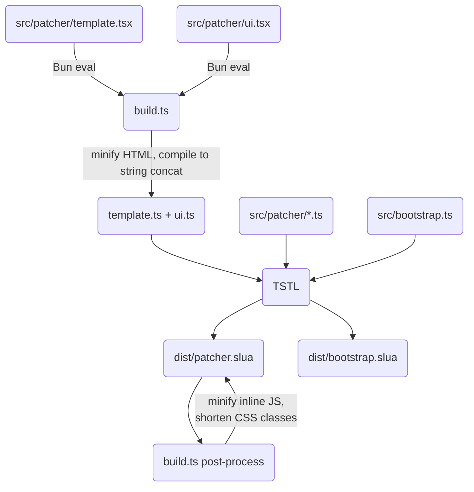
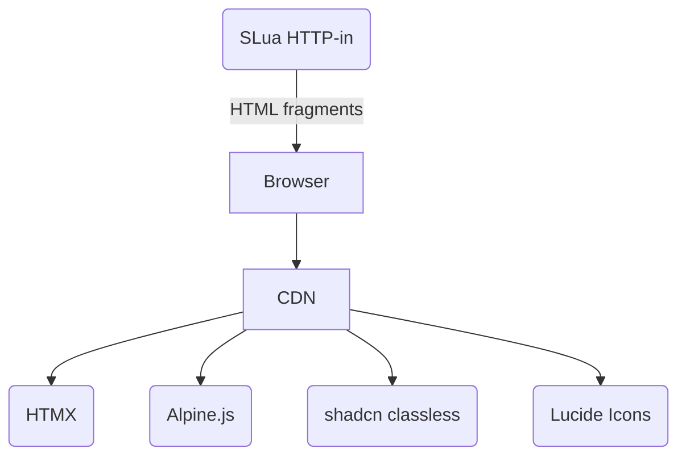

# SLua Derez Patcher

Tired of the rez-edit-take-replace dance every time you update objects your scripts rez?

Throw it all in one prim, child scripts set to not running, and let [`ll.RemoteLoadScriptPin`](https://wiki.secondlife.com/wiki/LlRemoteLoadScriptPin), [`ll.GiveInventory`](https://wiki.secondlife.com/wiki/LlGiveInventory), and [`ll.DerezObject`](https://wiki.secondlife.com/wiki/LlDerezObject) handle the work instead.

Built with [TypeScriptToLua](https://typescripttolua.github.io/) and [`@gwigz/slua-tstl-plugin`](https://github.com/gwigz/slua).

<p align="center">
  
</p>

## Quick Start

1. Drop `dist/patcher.slua` into your main prim
2. Drop `dist/bootstrap.slua` into each object you want to patch
3. Name your scripts, sounds, animations, etc. using the `ObjectName/ItemName` naming convention
4. Drop those named scripts/items into the same prim as the patcher
5. The patcher prints an HTTP-in URL to owner chat on start -- open it in a browser
6. Select objects, click patch, and watch it go

## Scripts

### `dist/patcher.slua` - belongs in your main object

On script start, requests an HTTP-in URL and prints it to owner chat. Open the URL in a browser to access the web UI dashboard where you can:

- Browse objects and items
- Select individual items, or use "Select All"
- Patch selected objects or all at once
- Watch live progress via long polling

Chat command `/7 url` prints the HTTP-in URL again if needed.

### `dist/bootstrap.slua` - add to each rezable object

Enables remote script loading. On rez by the patcher, sets the access pin and signals readiness back when done. Tweak to suit your workflow, i.e. if there's data you need to load from notecards: only state ready once you're actually ready.

## Inventory Layout

Items named `Object Name/Item Name` target that specific object. This works for scripts, notecards, textures, sounds, animations, and any other inventory type. Wrap the prefix in `{...}` for pattern matching.

| Item Name                             | Matches                                  |
| ------------------------------------- | ---------------------------------------- |
| `lantern.obj/vfx.slua`                | `lantern.obj` only (script)              |
| `lantern.obj/config.ini`              | `lantern.obj` only (notecard)            |
| `{*}/utilities.slua`                  | every object                             |
| `{fire-*.obj}/embers.slua`            | `fire-pit.obj`, `fire-torch.obj`, etc.   |
| `{*-light.obj}/dim.slua`              | `desk-light.obj`, `wall-light.obj`, etc. |
| `{lantern.obj,campfire.obj}/vfx.slua` | `lantern.obj` and `campfire.obj`         |

Extensions and casing are purely convention -- the matching is on the full inventory name before the `/`. Objects and the patcher script itself are always excluded from matching.

## How It Works

For each selected object, the patcher rezzes it at its own position, waits for the bootstrap script to set a pin and signal back, pushes any inventory items and scripts, then derezes it back. The browser gets live progress updates via long polling.


Scripts have a 3 second delay between each load (`ll.RemoteLoadScriptPin` is throttled by the sim), but non-script inventory transfers via `ll.GiveInventory` are instant. The bootstrap script in each object handles the pin setup and signals readiness -- tweak it if your object needs time to initialize before being taken back.

## Project Structure

```
├── build.ts                  Build script (template compilation + TSTL)
├── src/
│   ├── bootstrap.ts          Standalone bootstrap script
│   ├── constants.ts          Shared constants (PIN, channels)
│   └── patcher/
│       ├── index.ts          Entry point, HTTP-in routing, state, patch flow
│       ├── ui.tsx             HTML fragment builders, form parser
│       ├── template.tsx       Page shell and app fragment templates
│       ├── inventory.ts      Pattern matching and inventory queries
│       ├── effects.ts        Status text and particle effects
│       └── autopatch.ts      Auto-patch on inventory changes
└── dist/
    ├── patcher.slua          Bundled patcher script
    └── bootstrap.slua        Standalone bootstrap script
```

### Build Pipeline



### JSX Templates

The `.tsx` files in `src/patcher/` are **not** compiled by TSTL. They use JSX purely as a build-time HTML templating language, `build.ts` evaluates them with Bun, minifies the output, and writes plain `.ts` files that TSTL can compile to Luau.

#### How it works

`build.ts` ships a tiny inline JSX runtime (`h`, `Fragment`) that renders elements to HTML strings. At build time it:

1. Parses each `.tsx` file with [ts-morph](https://ts-morph.com) to find functions and consts that contain JSX
2. Evaluates them via Bun's `require()` (with the JSX runtime prepended)
3. Minifies the resulting HTML (collapsing whitespace, shortening CSS classes/IDs, aliasing CSS variables)
4. Writes a `.ts` file where every JSX expression has been replaced with a string literal or string-concatenation expression

The generated `.ts` files are deleted after TSTL compiles them, so the editor always resolves to the `.tsx` sources.

#### Slots

Function templates use **slots** to inject runtime values into static HTML. When `build.ts` evaluates a function like:

```tsx
function statusBusyBlock(index: string | number, total: string | number, pct: string | number) {
  return (
    <>
      <b>
        Patching {index}/{total} ({pct}%)
      </b>
      <progress value={index} max={total}></progress>
    </>
  );
}
```

It calls the function with marker strings `statusBusyBlock("__SLOT_index__", "__SLOT_total__", "__SLOT_pct__")`, then splits the minified HTML on those markers. The result is a TypeScript function body that concatenates static segments with runtime parameters:

```ts
function statusBusyBlock(index: string | number, total: string | number) {
  return (
    "<b>Patching " +
    index +
    "/" +
    total +
    "</b><progress value="' +
    index +
    '" max="' +
    total +
    '"></progress>'
  );
}
```

Const templates (no parameters, no slots) compile to plain string literals:

```tsx
// .tsx source
const STATUS_DONE = <b>Done</b>;

// compiled .ts output
const STATUS_DONE = "<b>Done</b>";
```

This gives you full JSX ergonomics for authoring HTML while producing minimal string-concat code at runtime, no JSX runtime ships to Luau.

#### Pure templates vs inline JSX

Functions whose body is a single `return <JSX>` are **pure templates** -- the build system replaces their entire body with a string-concat return. For simple one-off fragments you can also use JSX directly in runtime functions:

```tsx
// Pure template: single return, compiled to string concat
function listItem(item: string) {
  return <p>{item}</p>;
}

// Inline JSX: mixed with runtime logic, each JSX node compiled independently
function buildList(items: string[]) {
  let html = "";
  for (const item of items) {
    html += <p>{escapeHtml(item)}</p>;
  }
  return html;
}
```

Dynamic expressions (identifiers, function calls, template literals with interpolations) become slots in the concat. Static expressions (string/number/boolean literals, static object literals) are evaluated at build time and baked into the HTML.

> [!NOTE]
> Inline JSX doesn't support JSX nested inside dynamic expressions (`<div>{flag ? <A/> : <B/>}</div>` -- use `html += flag ? <A/> : <B/>` instead so each branch is a separate root node) or component-style JSX (`<MyComponent />`) since the component function isn't available in the build-time temp file.

### Web UI Stack

The web UI is served entirely from SLua's HTTP-in (no external server):



The stack is deliberately minimal, everything the script serves has to fit in SLua's script memory.

[HTMX](https://htmx.org) fits perfectly: the server sends tiny HTML fragments instead of JSON, and the client swaps them in place with no build step or client-side routing. [Alpine.js](https://alpinejs.dev) covers client-side state (checkbox toggles, select-all). [shadcn classless](https://github.com/fordus/shadcn-classless) gives a clean dark-mode look with zero classes, and [Lucide](https://lucide.dev) provides icons via `data-lucide` tags.

Everything loads from CDN so the SLua script never serves static assets.

### Routes

All routes are defined in the `http_request` event handler in `src/patcher/index.ts`.

| Method | Path                   | Description                                   |
| ------ | ---------------------- | --------------------------------------------- |
| GET    | `/`                    | Full page shell with base URL injected        |
| GET    | `/app`                 | App fragment (object list + controls)         |
| GET    | `/objects`             | Object list with items and checkboxes         |
| GET    | `/poll`                | Long poll -- held open until status changes   |
| POST   | `/patch`               | Patch selected objects (form body with items) |
| POST   | `/patch-all`           | Patch all objects at once                     |
| GET    | `/autoupdate`          | Auto-update controls fragment                 |
| POST   | `/autoupdate`          | Toggle autoupdate on/off                      |
| POST   | `/autoupdate-debounce` | Set autoupdate debounce interval              |

## Setup

```sh
bun install
bun run build
```

## Development

```sh
bun run dev        # watch mode
bun run lint       # lint with oxlint
bun run lint:fix   # lint and auto-fix
bun run fmt        # format with oxfmt
bun run fmt:check  # check formatting
```
