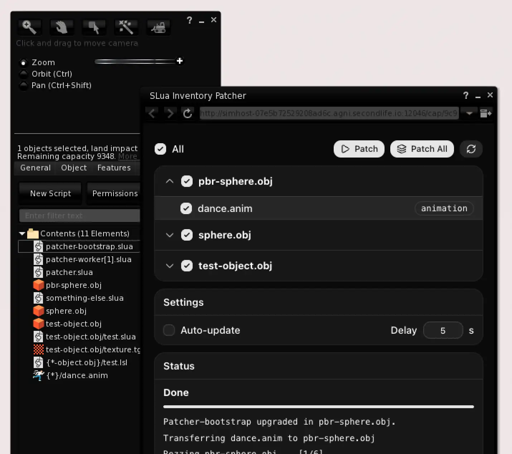

# SLua Derez Patcher

Tired of the rez-edit-take-replace dance every time you update objects your scripts rez?

Throw it all in one prim, child scripts set to not running, and let [`ll.RemoteLoadScriptPin`](https://wiki.secondlife.com/wiki/LlRemoteLoadScriptPin), [`ll.GiveInventory`](https://wiki.secondlife.com/wiki/LlGiveInventory), and [`ll.DerezObject`](https://wiki.secondlife.com/wiki/LlDerezObject) handle the work instead.

Built with [TypeScriptToLua](https://typescripttolua.github.io/) and [`@gwigz/slua-tstl-plugin`](https://github.com/gwigz/slua).

<p align="center">
  
</p>

## Quick Start

1. Drop `dist/patcher.slua` into your main prim
2. Drop `dist/patcher-bootstrap.slua` into each object you want to patch
3. Name your scripts, sounds, animations, etc. using the `ObjectName/ItemName` naming convention
4. Drop those named scripts/items into the same prim as the patcher
5. The patcher prints an HTTP-in URL to owner chat on start -- open it in a browser
6. Select objects, click patch, and watch it go

## Scripts

### `dist/patcher.slua` - belongs in your main object

On script start, requests an HTTP-in URL and prints it to owner chat. Open the URL in a browser to access the web UI dashboard where you can:

- Browse objects and items
- Select individual items, or use "Select All"
- Patch selected objects or all at once
- Watch live progress via long polling

Chat command `/7 url` prints the HTTP-in URL again if needed.

### `dist/patcher-bootstrap.slua` - add to each rezable object

Enables remote script loading. On rez by the patcher, sets the access pin and signals readiness back when done. Tweak to suit your workflow, i.e. if there's data you need to load from notecards: only state ready once you're actually ready.

### `dist/patcher-worker.slua` - optional, for parallel script loading

Place copies of this script in the same prim as the patcher, named `patcher-worker[1]`, `patcher-worker[2]`, etc. Each worker calls `ll.RemoteLoadScriptPin` concurrently, reducing total time from ~N\*3s to ~ceil(N/W)\*3s. The number in brackets is how the patcher and worker identify each other via linkset messages. Requires `WORKERS_ENABLED = true` in `src/constants.ts`.

## Inventory Layout

Items named `Object Name/Item Name` target that specific object. This works for scripts, notecards, textures, sounds, animations, and any other inventory type. Wrap the prefix in `{...}` for pattern matching.

| Item Name                             | Matches                                  |
| ------------------------------------- | ---------------------------------------- |
| `lantern.obj/vfx.slua`                | `lantern.obj` only (script)              |
| `lantern.obj/config.ini`              | `lantern.obj` only (notecard)            |
| `{*}/utilities.slua`                  | every object                             |
| `{fire-*.obj}/embers.slua`            | `fire-pit.obj`, `fire-torch.obj`, etc.   |
| `{*-light.obj}/dim.slua`              | `desk-light.obj`, `wall-light.obj`, etc. |
| `{lantern.obj,campfire.obj}/vfx.slua` | `lantern.obj` and `campfire.obj`         |

Extensions and casing are purely convention -- the matching is on the full inventory name before the `/`. Objects and the patcher script itself are always excluded from matching.

## How It Works

For each selected object, the patcher rezzes it at its own position, waits for the patcher-bootstrap script to set a pin and signal back, pushes any inventory items and scripts, then derezzes it back. The browser gets live progress updates via long polling.

Scripts have a ~3 second delay between each load (`ll.RemoteLoadScriptPin` is throttled by the sim), but non-script inventory transfers via `ll.GiveInventory` are instant. With worker scripts enabled, multiple scripts are loaded in parallel across workers, significantly reducing patch time for script-heavy objects.

See [docs/architecture.md](docs/architecture.md) for protocol diagrams, build pipeline, and project structure.

## Setup

```sh
bun install
bun run build
```

## Development

```sh
bun run dev        # watch mode
bun run lint       # lint with oxlint
bun run lint:fix   # lint and auto-fix
bun run fmt        # format with oxfmt
bun run fmt:check  # check formatting
```
