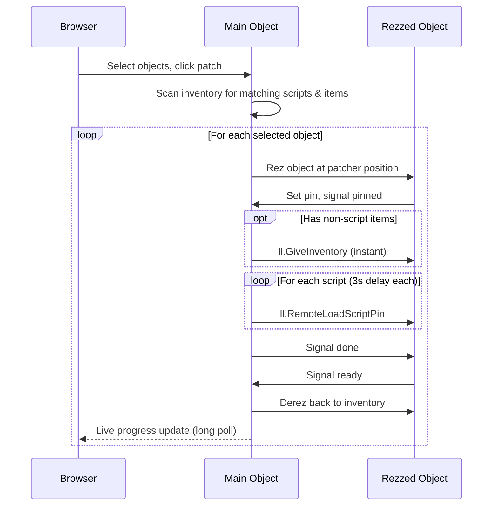
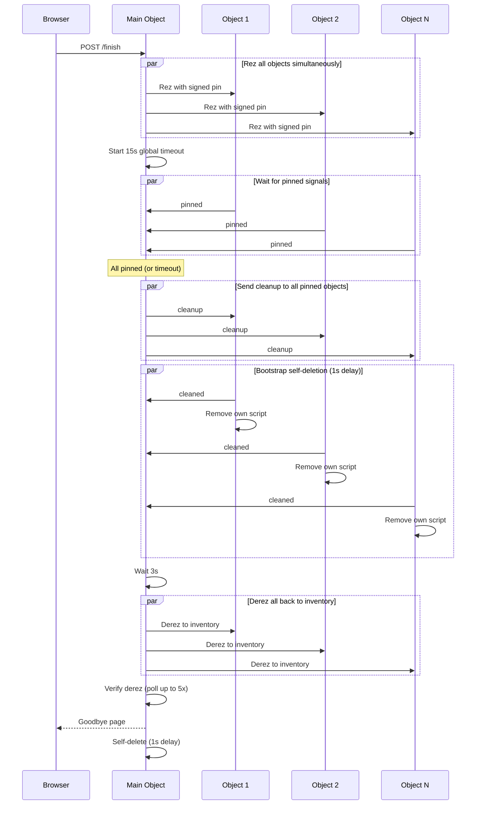
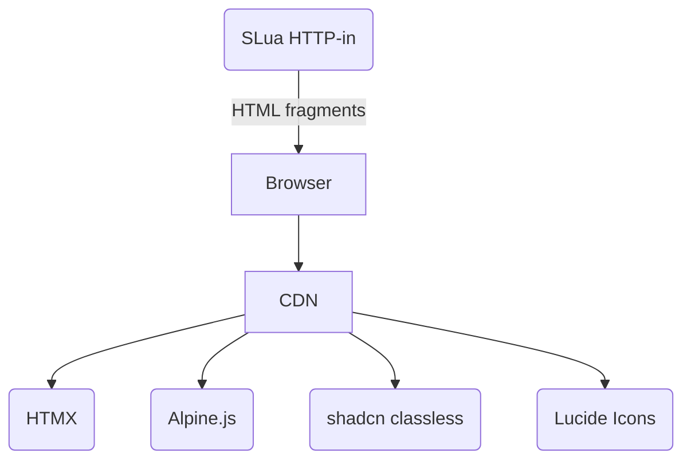

# Architecture

Technical reference for developers working on the patcher codebase.

## Patch Protocol

For each selected object, the patcher rezzes it at its own position, waits for the bootstrap script to set a pin and signal back, pushes any inventory items and scripts, then derezzes it back. The browser gets live progress updates via long polling.



Scripts have a 3 second delay between each load (`ll.RemoteLoadScriptPin` is throttled by the sim), but non-script inventory transfers via `ll.GiveInventory` are instant. The bootstrap script in each object handles the pin setup and signals readiness -- tweak it if your object needs time to initialize before being taken back.

## Finish (Cleanup) Protocol

The finish flow removes bootstrap scripts from all objects and then deletes the patcher. Unlike patching (which is sequential, one object at a time), cleanup rezzes all objects in parallel for speed.



## Design Decisions

- **Signed pin handshake**: Prevents unauthorized `ll.RemoteLoadScriptPin` access. The pin is cleared on rez, after patching, and during cleanup so it's never left active.
- **Sequential patching**: Each object needs multiple round-trips (item removal, script loading), so they are processed one at a time.
- **Parallel cleanup**: All objects are rezzed at once and each is verified before proceeding. If any step fails, the bootstraps are still intact so the user can retry.

## Project Structure

```
├── build.ts                  Build script (template compilation + TSTL)
├── src/
│   ├── bootstrap.ts          Standalone bootstrap script
│   ├── constants.ts          Shared constants (secret, channels)
│   └── patcher/
│       ├── index.ts          Entry point, HTTP-in routing, state, patch flow
│       ├── ui.tsx             HTML fragment builders, form parser
│       ├── template.tsx       Page shell and app fragment templates
│       ├── inventory.ts      Pattern matching and inventory queries
│       ├── effects.ts        Status text and particle effects
│       └── autopatch.ts      Auto-patch on inventory changes
└── dist/
    ├── patcher.slua          Bundled patcher script
    └── bootstrap.slua        Standalone bootstrap script
```

## Build Pipeline

```mermaid
flowchart TD
    A(src/patcher/*.tsx) -->|@gwigz/jsx-inline| B(generated .ts files)
    B --> C(TSTL)
    D(src/patcher/*.ts) --> C
    E(src/bootstrap.ts) --> C
    C -->|@gwigz/tstl-bundle-flatten| F(dist/patcher.slua)
    C --> G(dist/bootstrap.slua)
    F --> H(build.ts post-process)
    G --> H
    H -->|inject constants,\nStyLua format| F
    H -->|inject constants,\nStyLua format| G
```

## JSX Templates

The `.tsx` files in `src/patcher/` are **not** compiled by TSTL. They use JSX purely as a build-time HTML templating language -- [`@gwigz/jsx-inline`](https://github.com/gwigz/slua) evaluates them with Bun, minifies the output, and writes plain `.ts` files that TSTL can compile to Luau.

The generated `.ts` files are deleted after TSTL compiles them, so the editor always resolves to the `.tsx` sources.

### Slots

Function parameters become **slots** -- runtime values injected into static HTML:

```tsx
function statusBusyBlock(index: string | number, total: string | number, pct: string | number) {
  return (
    <>
      <b>
        Patching {index}/{total} ({pct}%)
      </b>
      <progress value={index} max={total}></progress>
    </>
  );
}
```

Compiles to string concatenation at build time:

```ts
function statusBusyBlock(index: string | number, total: string | number) {
  return (
    "<b>Patching " +
    index +
    "/" +
    total +
    "</b><progress value="' +
    index +
    '" max="' +
    total +
    '"></progress>'
  );
}
```

Const templates (no parameters, no slots) compile to plain string literals:

```tsx
// .tsx source
const STATUS_DONE = <b>Done</b>;

// compiled .ts output
const STATUS_DONE = "<b>Done</b>";
```

No JSX runtime ships to Luau.

### Pure templates vs inline JSX

Functions whose body is a single `return <JSX>` are **pure templates** -- the entire body is replaced with a string-concat return. For simple one-off fragments you can also use JSX directly in runtime functions:

```tsx
// Pure template: single return, compiled to string concat
function listItem(item: string) {
  return <p>{item}</p>;
}

// Inline JSX: mixed with runtime logic, each JSX node compiled independently
function buildList(items: string[]) {
  let html = "";

  for (const item of items) {
    html += <p>{escapeHtml(item)}</p>;
  }

  return html;
}
```

Dynamic expressions (identifiers, function calls, template literals with interpolations) become slots in the concat. Static expressions (string/number/boolean literals, static object literals) are evaluated at build time and baked into the HTML.

> [!NOTE]
> Inline JSX doesn't support JSX nested inside dynamic expressions (`<div>{flag ? <A/> : <B/>}</div>` -- use `html += flag ? <A/> : <B/>` instead so each branch is a separate root node) or component-style JSX (`<MyComponent />`) since the component function isn't available in the build-time temp file.

## Web UI Stack

The web UI is served entirely from SLua's HTTP-in (no external server):



The stack is deliberately minimal, everything the script serves has to fit in SLua's script memory.

[HTMX](https://htmx.org) fits perfectly: the server sends tiny HTML fragments instead of JSON, and the client swaps them in place with no build step or client-side routing. [Alpine.js](https://alpinejs.dev) covers client-side state (checkbox toggles, select-all). [shadcn classless](https://github.com/fordus/shadcn-classless) gives a clean dark-mode look with zero classes, and [Lucide](https://lucide.dev) provides icons via `data-lucide` tags.

Everything loads from CDN so the SLua script never serves static assets.

## Routes

All routes are defined in the `http_request` event handler in `src/patcher/index.ts`.

| Method | Path                   | Description                                   |
| ------ | ---------------------- | --------------------------------------------- |
| GET    | `/`                    | Full page shell with base URL injected        |
| GET    | `/app`                 | App fragment (object list + controls)         |
| GET    | `/objects`             | Object list with items and checkboxes         |
| GET    | `/poll`                | Long poll -- held open until status changes   |
| POST   | `/patch`               | Patch selected objects (form body with items) |
| POST   | `/patch-all`           | Patch all objects at once                     |
| POST   | `/finish`              | Remove bootstrap scripts and self-delete      |
| GET    | `/autoupdate`          | Auto-update controls fragment                 |
| POST   | `/autoupdate`          | Toggle autoupdate on/off                      |
| POST   | `/autoupdate-debounce` | Set autoupdate debounce interval              |
